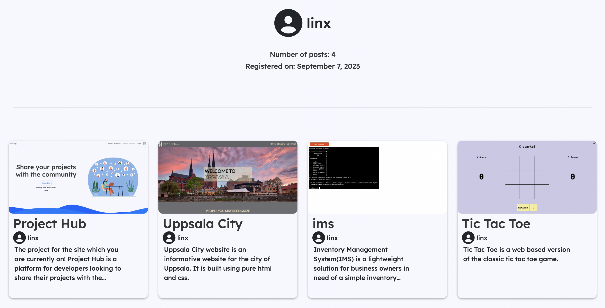

# Project Hub

Project Hub is a sharing platform mainly aimed at students of Code Institute looking to share their school projects and check out other students projects, but is open to everyone and all users are welcome.


## Features

<a name="navbar"></a>
### __Navbar__

__Fully responsive navbar with links to:__

    - Home page
    - Browse section
    - Project submission
    - Login section
    - Profile page

__Logo hyperlinked to home page:__


Featured on all pages across the site.

Adapts to if user is authenticated or not (Disables Project submission and profile links and switches the Login/Logout link)

__Navbar for non-authenticated users__:


__Navbar for authenticated users__:


___Purpose of feature:___
Provide users with an easy and straight-forward way to navigate the site

<a name="footer"></a>
### __Footer__

Featured on all pages across the site.
The footer contains links to my personal GitHub account aswell as my LinkedIn account.


___Purpose of feature:___
Provide users with a way to connect with me and check out my GitHub profile.

<a name="project-cards"></a>
### __Project cards__

The project cards are used in various places across the page.
They are hyperlinked to the page for that specific project and contains an image of the project if provided during project submission(else a default image not found image) aswell as the title and description provided during project submission


___Purpose of feature:___
Provide users with a simple, concise and aesthetic UI component to access user submitted projects.

<a name="home-page"></a>
### __Home page__

__The Home page consists of:__

    - Hero section
    - Hall of Fame section
    - Recently Added section
    - Browse by Category section


__Hero section__

The hero section features imagery appropriate for the site aswell as a call-to-action section allowing users to sign up or login, it also adapts to if user is authenticated or not:


___Purpose of feature:___
Provide users with a welcoming landing page and highly visible way to sign up or login to the site.

__Hall of Fame section__

The Hall of Fame section features three cards displaying the three most liked posts on the site in order from left to right.


___Purpose of feature:___
Provide users with a fast way to see which posts are popular.

__Recently Added section__

The Recently Added section features four cards displaying the four most recent posts on the site in order from left to right.


___Purpose of feature:___
Provide users with a fast way to see which posts are new on the site.

__Browse by Category section__
 
The Browse by Category section features a bootstrap accordion with items for all the categories on the site. Inside each accordion item is a link to the browse page for that specific category. Each accordion item for Code Institute projects also has the description for that project taken from the Code Institute assessment criteria sections.


___Purpose of feature:___
Provide users with a fast way to browse projects by category.

<a name="browse-page"></a>
### __Browse page__

__The Browse page consists of:__

    - Page header
    - Sort by button
    - Project cards


__Page header__

The page header displays the project category which the user is currently browsing.

___Purpose of feature:___
Provide users with a highly visible way to know which category is currently being browsed.

__Sort by button__

The sort by button allows the user to sort the content displayed by:
    - Alphabetical order (A-Z)
    - Recently Added
    - Top rated(Most liked)

___Purpose of feature:___
Provide users with an easy way to sort the content displayed based on the users interest.

[__Project Cards__](#project-cards)

<a name="project-submission-page"></a>
### __Project submission page__


__The Project submission page consists of:__

    - Submission form

__Submission form__

The submission form lets the user provide info about a project to then post to the database.

The content which the user is able to post is:

- Title
- Category
- Description
- Project image
- Live link to project
- GitHub Repo link

_Additional_: The project image field can either be provided with an image from the users local machine or the "Generate from link" button can be toggled which will then on form submission generate a screenshot from the "live link to project" provided and use as the project image.

___Purpose of feature:___
Provide users with a way to submit their projects to the site for others to see.

<a name="login-page"></a>
### __Login page__


__The Login page consists of:__

    - Login form

__Login form__

The login form allows the user to enter their credentials and authenticate to enter the sites authenticated state.

The login form also contains a link to the [Sign up page](#signup-page) in case the user is not already registered.

___Purpose of feature:___
Provide users with a way to login to the site.

<a name="signup-page"></a>
### __Sign up page__


__The Sign up page consists of:__

    - Sign up form

__Sign up form__

The Sign up form which is provided by django allows the user to enter credentials for registration on the site.

Through django it contains all the functionality for a secure registration and displays help text and error text to give the user feedback

The sign up form also contains a link to the [Login page](#login-page) in case the user already has an account.

___Purpose of feature:___
Provide users with a way to register an account on the site.

<a name="your-profile-page"></a>
### __Your profile page__


__The Your profile page consists of:__

    - Profile info section
    - Profile posts section

__Profile info section__

The profile info section contains following info about the profile:

- Username
- Number of posts
- Date which the user registered on

___Purpose of feature:___
Provide users with a way to get a quick overview of their account.

__Profile posts section__

The profile posts section contains [Project Cards](#project-cards) displaying the posts which has been uploaded by the user. Below each card are buttons allowing the user to either delete the post or update the posts info.

_Additional_: The delete button displays a modal requiring the user to confirm the deletion of the post.


___Purpose of feature:___
Provide users with a way to see their uploaded posts aswell as update or delete their posts as part of the CRUD(Create, read, update, delete) criteria.

<a name="profile-page"></a>
### __Profile page__



__The Profile page consists of:__

    - Profile info section
    - Profile posts section

The profile page is a copy of the [Your profile page](#your-profile-page) but without the "Your profile" header and options to update or delete posts.

The purpose of this page is for users to view other profiles than their own.

___Purpose of feature:___
Provide users with a way to see specific users and their posts.

<a name="project-page"></a>
### __Project page__


__The Project page consists of:__

    - Project image section
    - Profile section
    - Project info section
    - Project links
    - Readme section
    - Like button
    - Comment section

__Project image section__

The project image section displays the image provided during the project submission or a default image if no image was provided.

___Purpose of feature:___
Provide users with an image of the project.

__Profile section__

The profile section contains the username hyperlinked to their [Profile page](#profile-page) aswell as [Project cards](#project-cards) below displaying their posts.

The profile section is only visible on medium screen sizes(bootstrap preset) or larger.

_Additional_: On medium screen sizes and smaller, the username, hyperlinked to the [profile page](#profile-page) of the post author is instead visible below the project title.

___Purpose of feature:___
Provide users with a quick and easy way to see and visit specific users and a few of their posts.

__Project info section__

The project info section contains the project title and description provided during project submission.

___Purpose of feature:___
Provide users with a way to read the provided info for a post.

__Project links__

The project links (Live link to project and GitHub repo link) are displayed below the project info section and provide the user a way to check out the project.

___Purpose of feature:___
Provide users with a way to check out the project and it's associated GitHub repository.

__Readme section__


The Readme section allows the user to read the Readme.md file found on the GitHub repo link the author of the post provided during project submission.

_Additional_: If no GitHub repo link is provided or there is an error fetching the file, the readme section instead displays "Readme.md not available".

___Purpose of feature:___
Provide users with a way to read the Readme.md file associated with the project.

__Like button__

The like button, placed on the right end of the screen in height with the project title, allows users to like or unlike a post.

_Additional_: The like button adapts to if the user is authenticated or not. If the user is not authenticated the like button is disabled and displays a tooltip on hover.

___Purpose of feature:___
Provide users with a way to to like posts they find interesting.

__Comment section__


The comment section allows users to post comments on a post aswell as delete their own comments using the X button in the above image.

_Additional_: The delete button displays a modal requiring the user to confirm deletion of the comment.
## Testing

__Manual testing__

_Tests done with DEBUG = False in settings.py_

___Case:___ Accessing authorization required links without logging in:

- Link: http://127.0.0.1:8000/profile_page/

    Expected result: Redirect to home page
    
    Actual result: Server Error (500)

    Resolved by: Check user authenticated in associated view

- Link: http://127.0.0.1:8000/project_submission/

    Expected result: Redirect to home page
    
    Actual result: Project submission page loaded

    Resolved by: Check user authenticated in associated view

- Link: http://127.0.0.1:8000/project_update/14/

    Expected result: Redirect to home page
    
    Actual result: Project update page loaded

    Resolved by: Check user authenticated and post author in associated view

- Link: http://127.0.0.1:8000/delete_post/14/

    Expected result: Redirect to home page
    
    Actual result: Server Error (500)

    Resolved by: Check user authenticated and post author in associated view

- Link: http://127.0.0.1:8000/post_comment/14/

    Expected result: Redirect to home page
    
    Actual result: Server Error (500)

    Resolved by: Check user authenticated in associated view

- Link: http://127.0.0.1:8000/like_post/14/

    Expected result: Redirect to home page
    
    Actual result: Server Error (500)

    Resolved by: Check user authenticated in associated view

- Link: http://127.0.0.1:8000/delete_comment/10/14/

    Expected result: Redirect to home page
    
    Actual result: Server Error (500)

    Resolved by: Check user authenticated and comment owner in associated view

___Case:___ Inserting invalid or no data during project submission

- Test: Upload file larger than 10MB

    Expected result: Error message
    
    Actual result: Server Error (500)

    Resolved by: Write js script to validate inputs.

- Test: Upload file + toggle generate from link

    Expected result: Error message / Toggle not available when file uploaded
    
    Actual result: Post uploaded using image generated from link

    Resolved by: Write js script to validate inputs.

- Test: Post using a non github repo link in field:

    Expected result: Error message
    
    Actual result: Post uploaded successfully

    Resolved by: Write js script to validate inputs.

___Case:___ Inserting invalid or no data when updating existing post

- Test: Upload file larger than 10MB

    Expected result: Error message
    
    Actual result: Server Error (500)

    Resolved by: Write js script to validate inputs.

- Test: Upload file + toggle generate from link

    Expected result: Error message / Toggle not available when file uploaded
    
    Actual result: Post uploaded using image generated from link

    Resolved by: Write js script to validate inputs.

- Test: Post using a non github repo link in field:

    Expected result: Error message
    
    Actual result: Post uploaded successfully

    Resolved by: Write js script to validate inputs.

| Link                                      | Expected Result          | Actual Result                  | Resolved by                               |
|-------------------------------------------|--------------------------|--------------------------------|------------------------------------------|
| [http://127.0.0.1:8000/profile_page/](http://127.0.0.1:8000/profile_page/) | Redirect to home page   | Server Error (500)            | Check user authenticated in associated view |
| [http://127.0.0.1:8000/project_submission/](http://127.0.0.1:8000/project_submission/) | Redirect to home page   | Project submission page loaded  | Check user authenticated in associated view |
| [http://127.0.0.1:8000/project_update/14/](http://127.0.0.1:8000/project_update/14/) | Redirect to home page   | Project update page loaded      | Check user authenticated and post author in associated view |
| [http://127.0.0.1:8000/delete_post/14/](http://127.0.0.1:8000/delete_post/14/) | Redirect to home page   | Server Error (500)            | Check user authenticated and post author in associated view |
| [http://127.0.0.1:8000/post_comment/14/](http://127.0.0.1:8000/post_comment/14/) | Redirect to home page   | Server Error (500)            | Check user authenticated in associated view |
| [http://127.0.0.1:8000/like_post/14/](http://127.0.0.1:8000/like_post/14/) | Redirect to home page   | Server Error (500)            | Check user authenticated in associated view |
| [http://127.0.0.1:8000/delete_comment/10/14/](http://127.0.0.1:8000/delete_comment/10/14/) | Redirect to home page   | Server Error (500)            | Check user authenticated and comment owner in associated view |


| Test                                          | Expected Result                  | Actual Result                                       | Resolved by                               |
|-----------------------------------------------|----------------------------------|-----------------------------------------------------|------------------------------------------|
| Upload file larger than 10MB                  | Error message                    | Server Error (500)                                  | Write js script to validate inputs       |
| Upload file + toggle generate from link       | Error message / Toggle not available when file uploaded | Post uploaded using image generated from link | Write js script to validate inputs       |
| Post using a non-GitHub repo link in field    | Error message                    | Post uploaded successfully                           | Write js script to validate inputs       |


| Test                                          | Expected Result                  | Actual Result                                       | Resolved by                               |
|-----------------------------------------------|----------------------------------|-----------------------------------------------------|------------------------------------------|
| Upload file larger than 10MB                  | Error message                    | Server Error (500)                                  | Write js script to validate inputs       |
| Upload file + toggle generate from link       | Error message / Toggle not available when file uploaded | Post uploaded using image generated from link | Write js script to validate inputs       |
| Post using a non-GitHub repo link in field    | Error message                    | Post uploaded successfully                           | Write js script to validate inputs       |


__Unit testing__

Unit tests were written using PyTest and Selenium since Seleniums abillity to interact directly with the browser better reflects how the user actually would interact with the site. Tests were written with the AAA(Arrange, Act, Assert) principle in mind.

Unit test files:

    1. test_noauth_protection.py
        - Tests access to authorization required url routes when user is not authenticated
    2. test_auth.py
        - Tests sign up functionality
        - Tests login functionality
        - Tests access to profile page and project submission page when logged in
    3. test_misc.py
        - Tests access to login and signup page when already logged in
    4. test_like_comment.py
        - Tests like / unlike functionality
        - Tests comment / delete comment functionality
    5. test_submission_update.py
        - Tests invalid inputs in submission form
        - Tests invalid inputs in update project form


## Deployment

This project was deployed to Heroku using these steps:

    1. Fork or clone this repository
    2. Create a new Heroku app
    3. Set the buildpacks to Python
    4. Set the config vars for your database connection and api keys
    4. Link the Heroku app to the repository
    5. Click on deploy

## Run Locally

Clone the project

```bash
  git clone https://github.com/linx02/project-hub.git
```

Go to the project directory

```bash
  cd project_hub
```

Install dependencies

```bash
  pip3 install -r requirements.txt
```

Start the server

```bash
  python3 manage.py runserver
```

Note that you will have to setup your own database and API connections using these steps:

1. Create a file name "env.py" in the projects root directory.
2. Copy and paste this code in the env.py file and replace values with your own:

```python
import os

os.environ["DATABASE_URL"]=YOUR_DATABASE_URL
os.environ["SECRET_KEY"]=YOUR_SECRET_KEY
os.environ["CLOUDINARY_SECRET"]=YOUR_CLOUDINARY_SECRET
os.environ["THUMIO_AUTH"]=YOUR_THUMIO_AUTH_KEY
```

## Credits

__API's used__:

[GitHub' REST API](https://docs.github.com/en/rest?apiVersion=2022-11-28): For fetching Readme.md file for Readme section in [Project page](#project-page).

[Thum.io's URL API](https://www.thum.io/documentation/api/url): For generating screenshots of provided links during project submission.

__Libraries and frameworks__:

[Bootstrap](https://getbootstrap.com/): CSS framework used.

[Django](https://www.djangoproject.com/): Web framework used.

[GreenSock's GSAP](https://greensock.com/): For animations.

[PyTest](https://docs.pytest.org/en/7.4.x/): For testing.

[Selenium](https://www.selenium.dev/): For testing.

__Data storing__:

[PostgreSQL](https://www.postgresql.org/): Database management system used.

[Cloudinary](https://cloudinary.com/): For storing image files in the cloud.

__Media__:

[Freepik](https://www.freepik.com/): For svg in the hero section.

[Haikei](https://haikei.app/): For background svg on the [home page](#home-page).

[FontAwesome](https://fontawesome.com/): For icons.